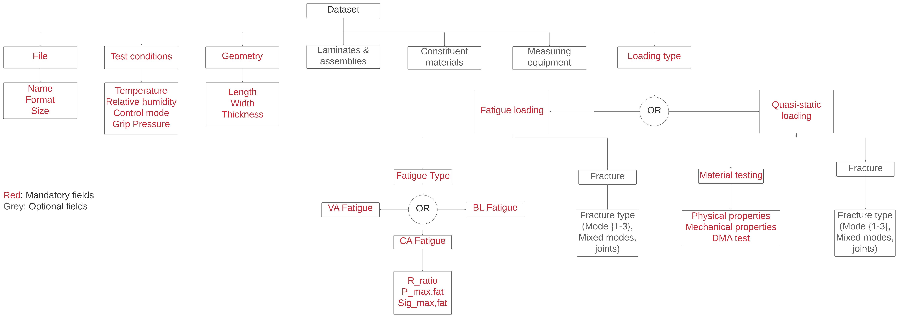
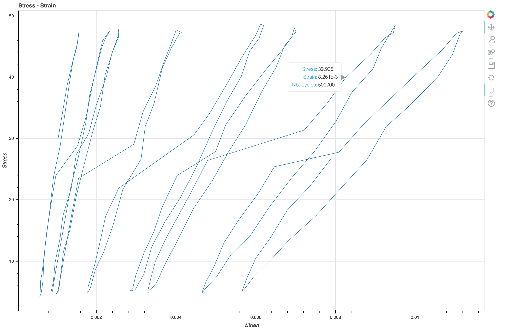
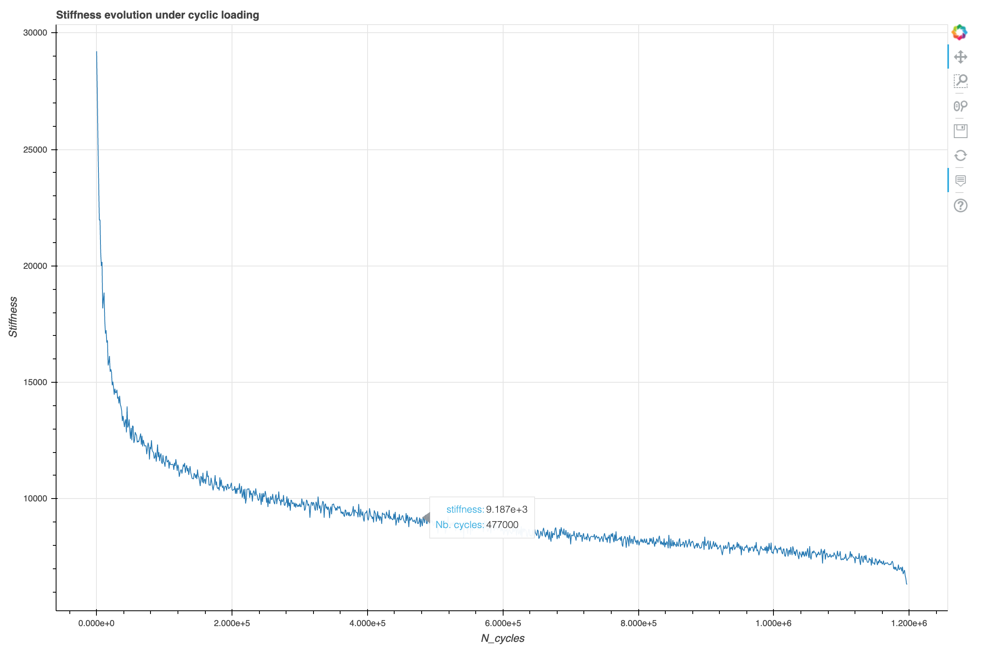
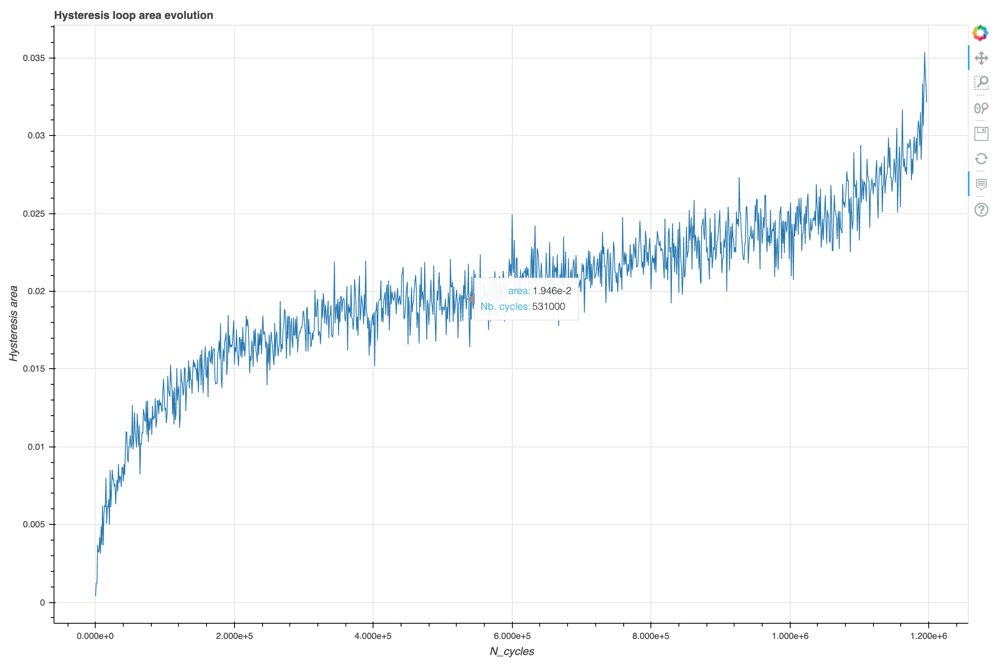
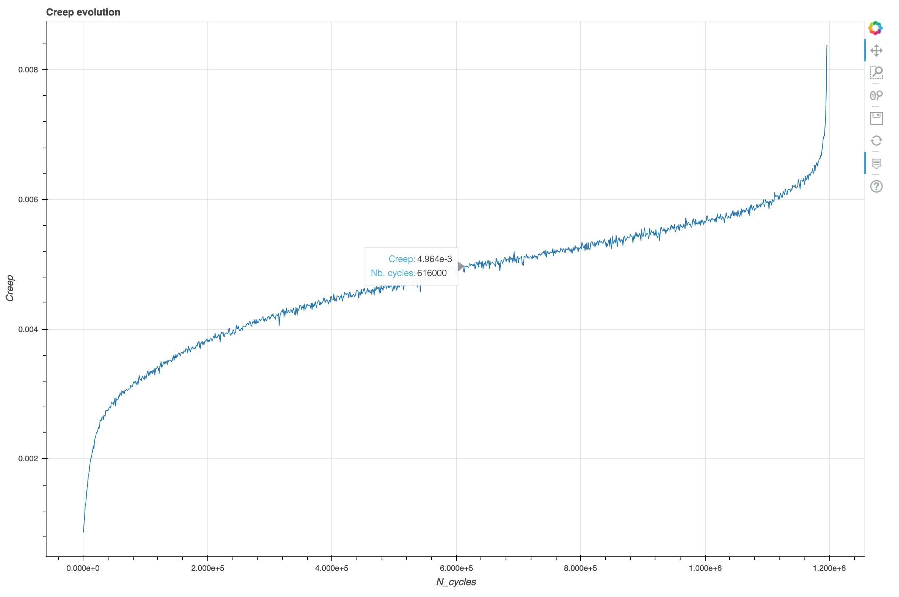

# CCFatigue Platform

CCFatiguePlatform is an initiative from CCLab that aims to develop a web application to faciltate manipulation and harmonized storage of composite materials testing datasets. 

# Data
## Standard data format
[Example of data in standard format](https://drive.google.com/file/d/1-SuUHPbW-xFr65yqVIbrqHl1vb4ejMzo/view?usp=sharing "Shayan's data in standard format")

|Directory naming convention|
|---------------------------|
|\Laboratory\Researcher\Test Type\Date\ *filename
|Laboratory: Full accronym (i.e. CCLab, RESSLab, IBeton,...)
|Researcher: Last name
|Test type: Standard Fatigue, Combined Fatigue Fracture, Standard Quasi-Static, Combined Quasi-Static Fracture
|Date: YYYY-MM-DD

|Filenaming conventions|
|-----------------------|
|{Researcher} _ {Date} _ {Test type} _ {status code} _ {###}|
|Researcher: 3 first letters of last name {i.e. VAS, WEI, MAT,...}
|Date: YYMMDD
|Test type: {FA} = standard fatigue, {QS} = standard quasi-static, {FF} = combined fatigue/fracture, {SF} = combined quasi-static/fracture
|Status code: {RAW} = raw data, {TRE} = treated
|###: numerical identifier
|Example: SHA _ 210420 _ FF _ RAW _ 001

# Contents

### Standardizing data
Notebook Standardizing_data.ipynb converts raw data from use cases to the standard format
Raw data format supported: The raw data is read in CSV format

Usage: Right now one needs to use python notebooks to call all methods

### Plots
Notebook Plotting.ipynb creates the following plots:

Stress / strain curve:

>On this graph we use the raw inputs for Stress and Strain, specific loops have been selected in order for the graph not to be too busy

>This graph shows the evolution of the sample's stiffness. Stiffness corresponds to the slope of hysteresis loops and is closely linked to hooke's law. E is comparable to the constant k in the context of springs. The analysis is made from the stress - strain raw data, for each hysteresis loop, we evaluate the slope with a linear regression for each hysteresis loops for stress and strain.

>Here we see how the area of each hysteresis loop evolves as the fatigue test goes on. The hysteresis loop area is closely related to the amount of energy dissipated through deformations, the sum of hysteresis areas is denoted as TDE, or total dissipated energy

>Creep corresponds to the residual deformations during a test or life cycle of a sample

%>>>> 

### Modules
Using the notebooks in the modules folder, one can compute the right parameters for plotting i.e. the notebook 'Hysteresis loops.ipynb' uses stress/strain info to compute the TDE and evolution of stiffness

# Reproduce

import matplotlib.pyplot as plt

import os

import pandas as pd

import numpy as np

from bokeh.plotting import figure

from bokeh.palettes import Spectral6

from bokeh.io import export_png, output_file, show

from bokeh.models import ColumnDataSource, HoverTool, LinearColorMapper

import bokeh.plotting as bk

from bokeh.transform import linear_cmap

from collections import Counter

from scipy import stats

# License
TBD.

# Authors
Charlotte Weil, Scott M. Salmon, Samuel Bancal.
