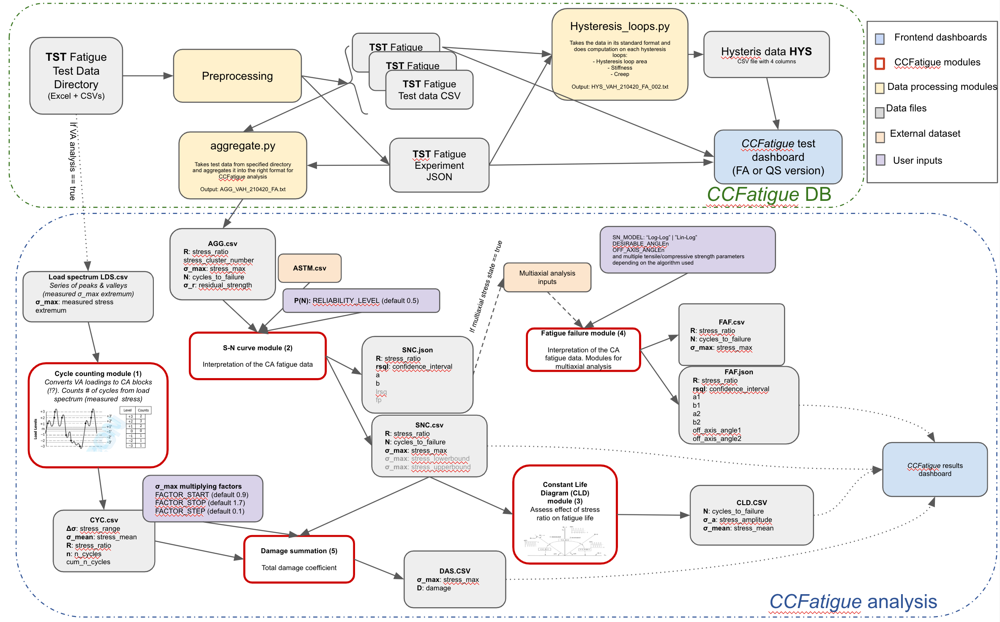

# CCFatigue Platform

CCFatiguePlatform is an initiative from CCLab that aims to develop a web application to faciltate manipulation and harmonized storage of composite materials testing datasets.

[Demo](https://ccfatigue-test.epfl.ch/)

# Web app: Usage

## Secrets

```bash
mkdir -p secrets && cat <<EOF > secrets/.env
POSTGRES_USER=ccfatigue
POSTGRES_PASSWORD=change-it!
EOF
```

## First time setup

```bash
make install
```

## Run Preprocessing

```bash
make preprocessing
```

## Re-generate API bindings btw backend and frontend

```bash
make api
```

## Run Backend

```bash
make dev-database
make dev-backend
```

First time backend setup/init :

```bash
make init-database
```

## Run Frontend

```bash
make dev-frontend
```

## Server provisioning

```bash
make run
```

# App architecture



# License

MIT

# Contributors

Charlotte Weil, Samuel Bancal, David Tang, Scott M. Salmon, Anastasios Vassilopoulos, Shayan Khalooei
