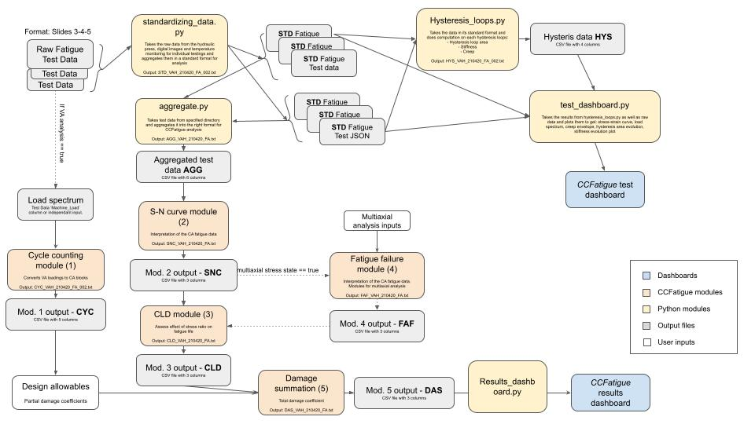

# CCFatigue Platform

CCFatiguePlatform is an initiative from CCLab that aims to develop a web application to faciltate manipulation and harmonized storage of composite materials testing datasets.

[Demo](https://ccfatigue-test.epfl.ch/)

# Web app: Usage

## Setup & run locally (without CCFatigue modules)

1. run backend according to [backend/README.md](backend/README.md)
2. run frontend according to [frontend/README.md](frontend/README.md)

## Server provisioning
See https://github.com/EPFL-ENAC/SB_Sysadmin/tree/enacvm0056

# Web app structure

# License
TBD.

# Contributors
Charlotte Weil, Samuel Bancal, David Tang, Scott M. Salmon, Anastasios Vassilopoulos, Shayan Khalooei
