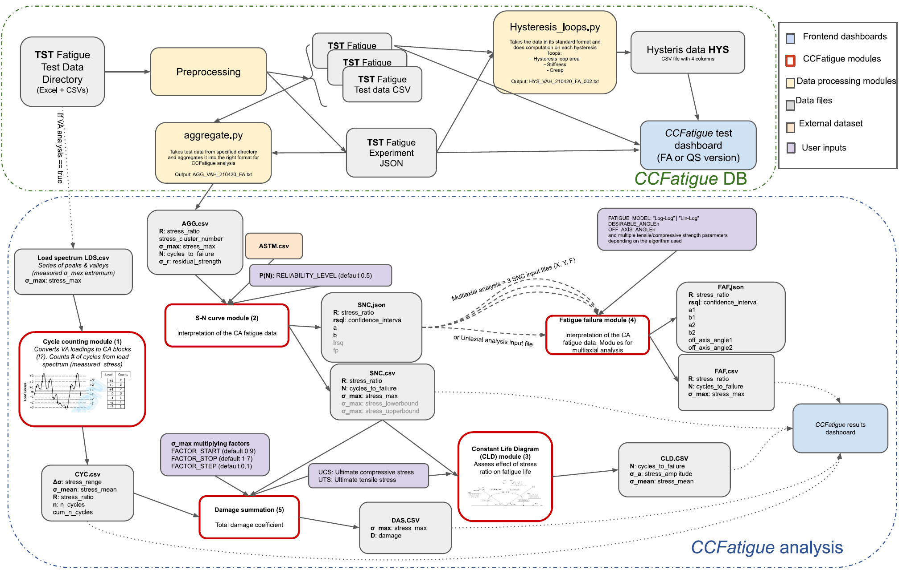

# CCFatigue Platform

CCFatiguePlatform is an initiative from CCLab that aims to develop a web application to faciltate manipulation and harmonized storage of composite materials testing datasets.

[Demo](https://ccfatigue-test.epfl.ch/)

# How to use on your desktop

## Secrets

```bash
mkdir -p secrets && cat <<EOF > secrets/.env
POSTGRES_USER=ccfatigue
POSTGRES_PASSWORD=mannino
EOF
```

## First time setup

```bash
make install
```

## Run Backend

```bash
make dev-database
make dev-backend
```

## Run Frontend

```bash
make dev-frontend
```

# Dev tools

## Run Preprocessing

```bash
make preprocessing
```

## Re-generate API bindings btw backend and frontend

```bash
make api
```

# Server provisioning

```bash
make run
```

# App architecture



# Original analysis fortran modules

The modules have been removed from the project but can be viewed [here](https://github.com/EPFL-ENAC/CCFatiguePlatform/tree/cde13599121bceb95d579adfe3e56056ba622d60/CCFatigue_modules).

# License

MIT

# Contributors

Charlotte Weil, Samuel Bancal, David Tang, Nicolas Dubois, Pierre Guilbert, Yannick Marcon Scott M. Salmon, Anastasios Vassilopoulos, Shayan Khalooei
